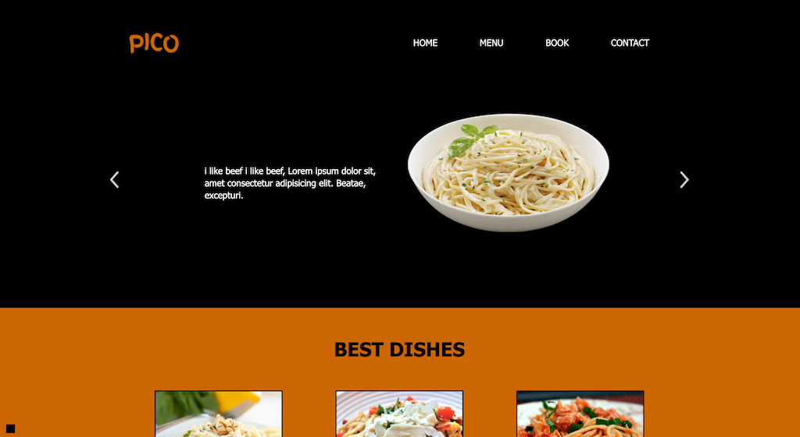

# RESTAURANT Website

[](https://erxxx4321.github.io/restaurant/) <br><br>

## Description

One page restaurant website built with vanilla Javascript and files bundled by webpack. Using json-server to create fake REST API.

## Project setup

```
npm install
```

### Compiles and hot-reloads for development

```
npm run dev
```

## Main Features

-   [x] Webpack configuration
-   [x] Fake api with json-server
-   [x] vanilla Javascript
